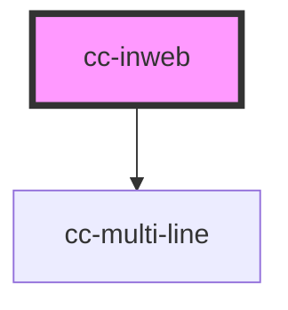

# cc-inweb

<!-- Auto Generated Below -->

## Properties

| Property                          | Attribute                              | Description                                                                                                           | Type                           | Default                                                                                 |
| --------------------------------- | -------------------------------------- | --------------------------------------------------------------------------------------------------------------------- | ------------------------------ | --------------------------------------------------------------------------------------- |
| `conditionalThankYou`             | --                                     | Show conditional thank you message based on the response works only for Yes/No question                               | `{ yes: string; no: string; }` | `{     yes: "Thank you for your response!",     no: "Thank you for your response!"   }` |
| `conditionalThankYouTextCallBack` | `conditional-thank-you-text-call-back` | Callbacks that will evaluate a condition for thank you text                                                           | `any`                          | `undefined`                                                                             |
| `cookieId`                        | `cookie-id`                            | Use Custom key for managing throttling                                                                                | `any`                          | `undefined`                                                                             |
| `doNotPost`                       | `do-not-post`                          | Opt out of sending response to server. Handle in event hooks                                                          | `boolean`                      | `false`                                                                                 |
| `followUpQuestionId`              | `follow-up-question-id`                | Question id for follow up response                                                                                    | `string`                       | `undefined`                                                                             |
| `followUpQuestions`               | `follow-up-questions`                  | Dictionary of followUp options to be asked                                                                            | `any`                          | `undefined`                                                                             |
| `hideAfterSubmission`             | `hide-after-submission`                | Optionally hide the survey after submission                                                                           | `boolean`                      | `false`                                                                                 |
| `icons`                           | `icons`                                | Use icons or text based options                                                                                       | `"hide" \| "show"`             | `"show"`                                                                                |
| `model`                           | `model`                                |                                                                                                                       | `any`                          | `undefined`                                                                             |
| `position`                        | `position`                             |                                                                                                                       | `"above" \| "below"`           | `"above"`                                                                               |
| `prefills`                        | `prefills`                             | prefills                                                                                                              | `any`                          | `undefined`                                                                             |
| `question`                        | `question`                             | Question text that will be shown to the user                                                                          | `string`                       | `"Was this helpful?"`                                                                   |
| `questionId`                      | `question-id`                          | Question-Id to post responses for                                                                                     | `string`                       | `undefined`                                                                             |
| `surveySettings`                  | `survey-settings`                      | Set survey settings from a central location. This will be handy to use same token with multiple survey within a page. | `any`                          | `undefined`                                                                             |
| `throttleForDays`                 | `throttle-for-days`                    | Configure throttling duration                                                                                         | `number`                       | `3`                                                                                     |
| `token`                           | `token`                                | token to submit responses                                                                                             | `string`                       | `undefined`                                                                             |
| `type`                            | `type`                                 |                                                                                                                       | `any`                          | `null`                                                                                  |
| `useToken`                        | `use-token`                            | Force the component to get token settings from server. It will use the first valid question to show.                  | `boolean`                      | `false`                                                                                 |

## Events

| Event               | Description | Type               |
| ------------------- | ----------- | ------------------ |
| `cc-inweb-response` |             | `CustomEvent<any>` |

## Dependencies

### Depends on

- [cc-multi-line](../multi-line)

### Graph

----------------------------------------------

*Built with [StencilJS](https://stenciljs.com/)*
