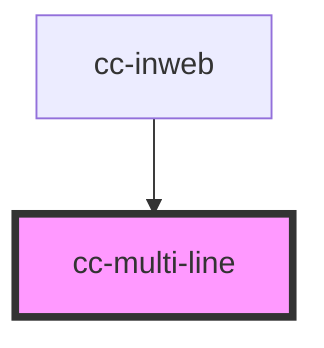

# cc-multi-line

<!-- Auto Generated Below -->

## Properties

| Property      | Attribute     | Description                            | Type     | Default                      |
| ------------- | ------------- | -------------------------------------- | -------- | ---------------------------- |
| `placeholder` | `placeholder` |                                        | `string` | `"Enter your response here"` |
| `question`    | `question`    | Question to ask the user for open text | `string` | `undefined`                  |

## Events

| Event               | Description | Type               |
| ------------------- | ----------- | ------------------ |
| `multilineAnswered` |             | `CustomEvent<any>` |

## Dependencies

### Used by

 - [cc-inweb](../inweb)

### Graph

----------------------------------------------

*Built with [StencilJS](https://stenciljs.com/)*
